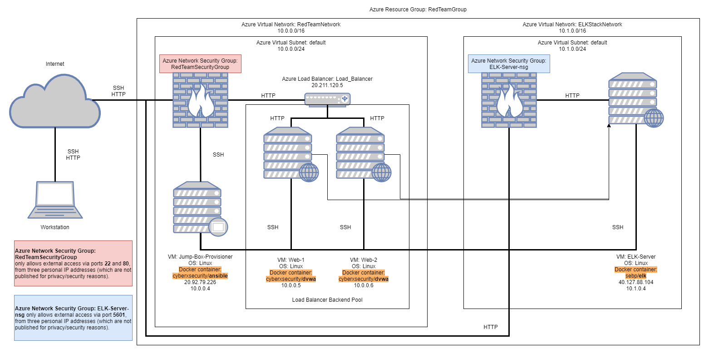

## Automated ELK Stack Deployment

The files in this repository were used to configure the network depicted below.

These files have been tested and used to generate a live ELK deployment on Azure. They can be used to either recreate the entire deployment pictured above. Alternatively, select playbook files may be used to install only certain pieces of it, such as Filebeat or Metricbeat.

[filebeat-playbook.yml](Ansible/roles/filebeat-playbook.yml)
[metricbeat-playbook.yml](Ansible/roles/metricbeat-playbook.yml)

This document contains the following details:
- Description of the Topology
- Access Policies
- ELK Configuration
  - Beats in Use
  - Machines Being Monitored
- How to Use the Ansible Build

### Description of the Topology

The main purpose of this network is to expose a load-balanced and monitored instance of DVWA, the D*mn Vulnerable Web Application.

Load balancing ensures that the application will be highly available, in addition to restricting access to the network.
- Load balancers help protect servers from Denial of Service attacks.
- The advantage of using a jump box is that it shields the virtual machines from unnecessary public exposure on the internet.

Integrating an ELK server allows users to easily monitor the vulnerable VMs for changes to the log files and system performance.
- Filebeat watches log events.
- Metricbeat records system-level metrics.

The configuration details of each machine may be found below.

| Name                 | Function  | IP Address | Operating System   |
|----------------------|-----------|------------|--------------------|
| Jump-Box-Provisioner | Gateway   | 10.0.0.4   | Ubuntu 20.04.3 LTS |
| Web-1                | VM        | 10.0.0.5   | Ubuntu 20.04.3 LTS |
| Web-2                | VM        | 10.0.0.6   | Ubuntu 20.04.3 LTS |
| ELK-Server           | ELK Stack | 10.1.0.4   | Ubuntu 20.04.3 LTS |

### Access Policies

The machines on the internal network are not exposed to the public Internet. 

Only the Jump Box machine can accept connections from the Internet. Access to this machine is only allowed from the following IP addresses:
- 122.150.61.155 (home IP)
- 49.255.X1.X2 (work IP #1, obfuscated for security)
- 49.255.Y1.Y2 (work IP #2, obfuscated for security)

Machines within the network can only be accessed via SSH from the Jump Box.

The ELK Stack server can be accessed via port 5601 by the same three IP addresses listed above.

A summary of the access policies in place can be found in the table below.

| Name                 | Publicly Accessible | Allowed IP Addresses                      |
|----------------------|---------------------|-------------------------------------------|
| Jump-Box-Provisioner | No                  | Home-IP, Work IP #1, Work IP #2           |
| Web-1, Web-2         | No                  | Home-IP, Work IP #1, Work IP #2, 10.0.0.4 |
| ELK-Server           | No                  | Home-IP, Work IP #1, Work IP #2, 10.0.0.4 |

### Elk Configuration

Ansible was used to automate configuration of the ELK machine. No configuration was performed manually, which is advantageous because we can easily replicate the configuration across multiple machines, regardless of number.

The playbook implements the following tasks:
- Install docker.io
- Install python3-pip
- Install Docker module
- Increase virtual memory
- Force the VM to use more memory
- Download and launch a docker ELK container
- Enable service docker on boot

The following screenshot displays the result of running `docker ps` after successfully configuring the ELK instance.

### Target Machines & Beats

This ELK server is configured to monitor the following machines:
- 10.0.0.5 (Web-1)
- 10.0.0.6 (Web-2)

We have installed the following Beats on these machines:
- Filebeat
- Metricbeat

These Beats allow us to collect the following information from each machine:
- Filebeat collects log events, such as SSH login attempts.
- Metricbeat collects system-level metrics, such as CPU usage.

### Using the Playbook

In order to use the playbook, you will need to have an Ansible control node already configured. Assuming you have such a control node provisioned: 

SSH into the control node and follow the steps below:
- Copy the [install-elk.yml](Ansible/install-elk.yml) file to /etc/ansible/.
- Update the hosts file to include the private IP address of the ELK Server under '[elk]'.
- Run the playbook, and navigate to http://<IP.of.ELK.Server>:5601/app/kibana to check that the installation worked as expected.

'''bash
curl https://raw.githubusercontent.com/shay-wafer-au/cybersec-project1/main/Ansible/install-elk.yml > /etc/ansible/install-elk.yml
nano /etc/ansible/hosts # Add the private IP address of the ELK Server under [elk]
ansible-playbook /etc/ansible/install-elk.yml
'''

